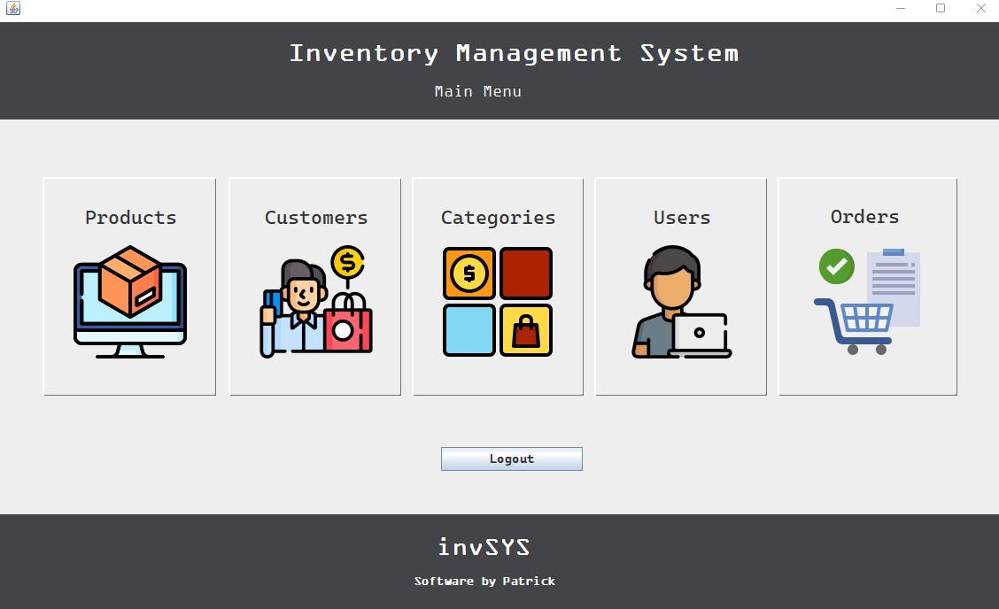
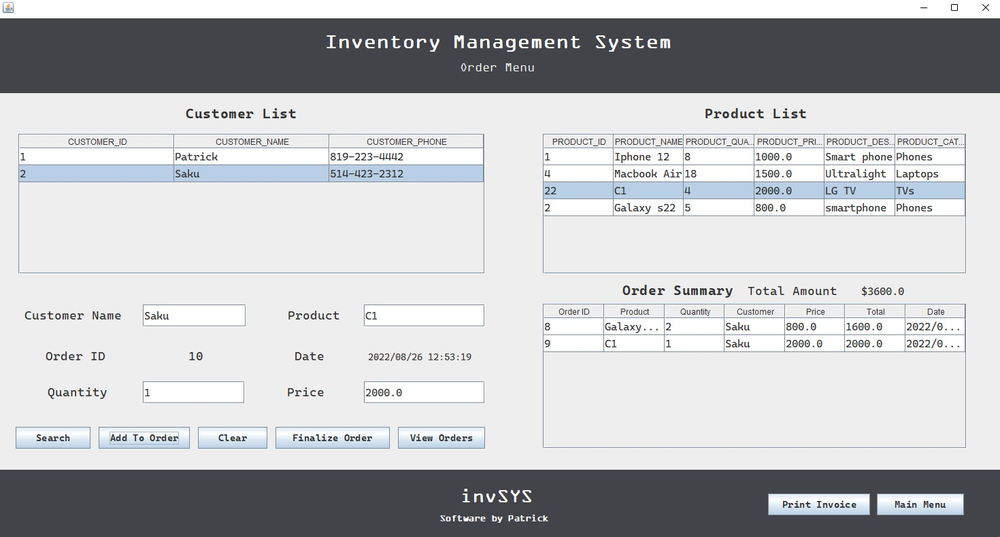

# Programming Patterns and Algorithms - Final Project

Name: Patrick Larocque   
Student ID: 0879202   
  
  
invSYS is an Inventory Management System with full CRUD functionality.  
Database implementation via Apache Derby emebed drivers.  
Case base built entirely using core Java.  
GUI built using java.Swing.   
All icon assets screenshots located in the inventorymanagementsystem/assets folder.    
Inventory Management System directory uploaded to github at: <https://github.com/PatrickLarocque/Web-Development>  

## Screenshots

## Insructions

Add Java DB Driver to the project.  
Add Derby .jars to class path. Located @Derby/db-derby-10.14.2.0-bin/lib  
Add Apache DbUtils .jars to class path. Located @common-dbutils-1.7/